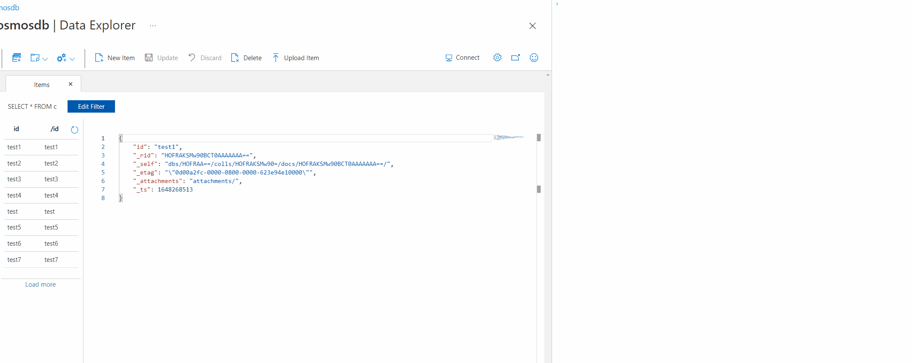

Usually when faced with a manual task regarding a third-party website a software engineer will look up that website's APIs and make a Python or Bash script to directly interact with those APIs. These scripts are often a pain in the ass to write; you have to try to remember or Google how basic Bash syntax works, like is it `if [` or `if [[`. In addition, these scripts just rot within your local notes folder and are difficult to reuse in the future. 

Recently, instead of resorting to using a website's APIs, I’ve created small little code blocks that interact with the UI directly which run through the browser’s Dev Console. I've found that these snippets of code often end up being much quicker to write and easier to understand.

For example, I had to delete a couple hundred items from one of our internal applications. I could have written a Python script that fetched all the items I needed to delete and then sent out individual requests to delete each item one-by-one. Instead, I wrote the following code block (which repeatedly clicks the delete button over and over) and let it run within Chrome's Dev Console of the correct page for a couple of minutes, while I made myself lunch. That’s what I call efficiency!

```javascript
var addRepos = true;
setInterval(() => {
  if (addRepos) {
    document.activeElement.click();
    document.getElementById("sug-0").click();
  }
}, 500);
```

In another case, I had accidentally inserted documents into the wrong collection within CosmosDB. I wasn't too familiar with the CosmosDB Rest API, nor with their authorization flow that I would have needed in order to authorize my DELETE calls (as well as potentially having to fetch refresh tokens or rerun the app if the token I fetched expired) <sup id="a1">[1](#f1)</sup>. Do I have the time to figure it out? Maybe. But do I want to spend my time figuring it out? Nope. Instead, like what I did above, I wrote a small script that would manually click the delete button for me.

```javascript
var deleteDoc = true;
setInterval(() => {
  if (deleteDoc) {
    document.evaluate('(//div[@class="documentsTabGridAndEditor"])[1]//child::a', document, null, XPathResult.ANY_TYPE, null).iterateNext().click();

    setTimeout(() => {
      document.querySelectorAll("[data-test=Delete]")[0].click();

      setTimeout(() => {
        document.evaluate('(//*[text()="Delete"]/parent::*/parent::*/parent::button)[2]', document, null, XPathResult.ANY_TYPE, null).iterateNext().click();

      }, 500);
    }, 500);
  }
}, 1500);
```

Here's an example of the script running 



As the GIF above demonstrates, I'm adding a flag to my snippets which I can turn `false` whenever I want the snippet to stop running (if, for example, I notice it is deleting something that it shouldn't). Alternatively, you can just refresh the page.

In both cases you can see how designing a website correctly (i.e., properly setting focus, giving elements the correct IDs etc.), shortens the snippets you need to write, as well as making them more readable. This has helped me become more cognizant of the UI code I've written since; now, my UI code is structured to facilitate the use of these techniques.

Another benefit of this approach is that you get to "babysit" your program. You can directly see what you're interacting with and if anything is going wrong. Ideally the UI you are using should prevent illegal actions from taking place, while backends might not always check for illegal operations. So if you see giant warnings saying this operation is invalid, you know your code is doing something wrong.

While this technique will work for small day to day tasks, relying on the UI isn't the best idea if you are attempting to perform large bulk operations. I was deleting hundreds of items, but if you were deleting millions of items this method wouldn't scale as well (unless you open multiple tabs to run the script multiple times). This technique is also prone to timing issues. Luckily the UI's I was using were pretty performant, but even still, I was expecting the deletion pop-up menu to take `500ms` to appear, which slows down the script considerably compared to firing off all the HTTP requests one after another.

# Notes


<b id="f1">[1]</b> I've found performing HTTP calls through the browser (rather than through the command line) has made authorizing quite easy. I would navigate to our UI which stores the bearer token within Chrome's local storage and reference that token in the snippet that runs in Chrome's Dev Console.

Here is a stripped-down example of such snippet

```javascript
const req = new XMLHttpRequest();
const url='https://api.prod.com/products/v1/get';
req.open("GET", url);
req.setRequestHeader("authorization", "Bearer " + window.localStorage.getItem("adal.idtoken"));
req.setRequestHeader("Content-Type", "application/json; charset=utf-8");
req.send();

req.onreadystatechange = (e) => {
  console.log(req.responseText)
}
```

This way I don't need to worry about generating the token myself.  [↩](#a1)