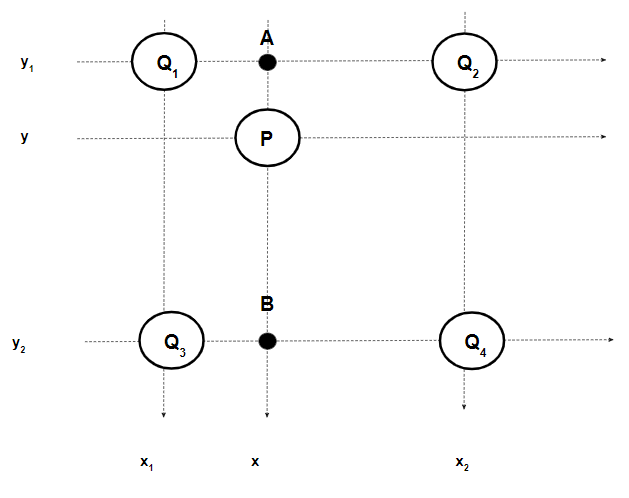
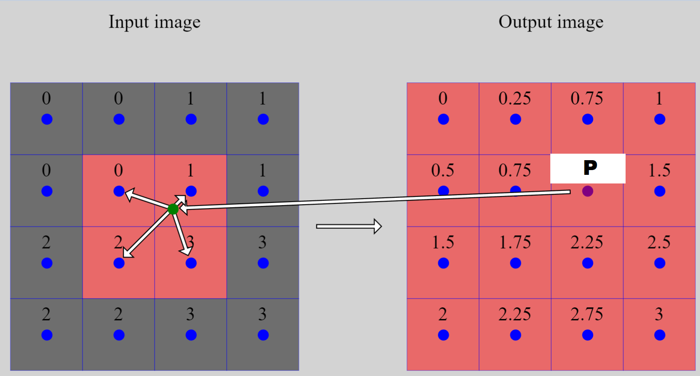

<script type="text/javascript" async src='https://cdnjs.cloudflare.com/ajax/libs/mathjax/2.7.2/MathJax.js?config=TeX-MML-AM_CHTML'></script>

<script type="text/x-mathjax-config">
  MathJax.Hub.Config({ TeX: { extensions: ["color.js"] }});
</script>

# Introduction

In my last image interpolation post we discussed the [nearest neighbor interpolation algorithm](./nearest-neighbour). While relatively straight forward, the results are often good enough for everyday casual use.

For this post we will be covering [bilinear interpolation](https://en.wikipedia.org/wiki/Bilinear_interpolation). Bilinear interpolation reuses the pixel projection topic I covered in my last post. However I will cover it again, briefly, in this post. But, if that topic confuses you, I would recommend reading my last post first before moving onto this one.

As in the last post we'll be comparing this blog's implementation against [OpenCV](https://opencv.org/) therefore certain choices will be made in order to mimic OpenCV's implementation.

# What is interpolation?

Before hoping into bilinear interpolation we first need to understand what interpolation is. [Wikipedia's definition](https://en.wikipedia.org/wiki/Interpolation) isn't half bad

> In the mathematical field of numerical analysis, interpolation is a type of estimation, a method of constructing (finding) new data points based on the range of a discrete set of known data points.

In simpler terms, given several known points, we would like to estimate another points, unknown, value.

Interpolation covers a wide variety of techniques, we are interested in [linear interpolation](https://en.wikipedia.org/wiki/Linear_interpolation) (as it is the basis for bilinear interpolation, hopefully evident by its name).

A simplified version of linear interpolation works like the following; imagine we have a point $$ C $$ with an unknown value, as well as points (point $$ A $$ and point $$ B $$) with known values. Assuming point $$ C $$ is between point $$ A $$ and point $$ B $$, then we can estimate point $$ C $$'s value by doing a weighted average of its distance to the two known values. The closer point $$ C $$ is to either end of the spectrum the more influence (over point $$ C $$'s value) that end point has.

Let's look at two examples. One which your gut will probably tell you the right answer, and the other example will let us get our hands dirty with the math.

Imagine we are in a $$ 1 $$ dimensional space with points $$ A, B, C $$ each respectively at $$ x = 0, x = 2, x = 1 $$, where point $$ A $$ has a value of $$ 0 $$ and point $$ B $$ has a value of $$ 2 $$. Given that point $$ C $$ lies directly at the halfway point between $$ A $$ and $$ B $$, you can intuitively guess that point $$ C $$'s value will be $$ 1 $$. 

While our intuition works well for that example, let's try something a little more challenging. Let's assume point $$ A, B, C $$ are instead at $$ x = 1, x = 3, x = 2.5 $$, with point $$ A $$ having a value of $$ 1 $$ and point $$ B $$ having a value of $$ 4 $$. What is point $$ C $$'s value? It's a little harder to guess, so let's look back at the definition of linear interpolation. Point $$ C $$'s value will be the weighted average of its distance to point $$ A $$ and point $$ B $$. 

Intuitively that should make sense, if point $$ C $$ is just a smidge away from point $$ B $$ then there values should almost be identical. In this case point $$ C $$ is $$ 75\% $$ away from point $$ A, ( \frac{2.5 - 1}{3 - 1} ) $$ and $$ 25\% $$ away from point $$ B, ( \frac{3 - 2.5}{3 - 1} ) $$. Therefore point $$ C $$'s value should be $$ 75\% $$ of point $$ B $$'s value and $$ 25\% $$ of point $$ A $$'s value (notice how the weights are assigned to the other end point).

Let's describe this more formally. Given two points $$ ( x_0,  y_0 ) $$ and $$ ( x_1, y_1 ) $$, we can interpolate an unknown points value $$ y $$ given its position $$ x $$ by the following formula: 

$$ 

y = y_0 (\frac{x_1 - x}{x_1 - x_0}) + y_1 (\frac{x - x_0}{x_1 - x_0}) 

$$

# From linear interpolation to bilinear interpolation

We've seen how we can interpolate an unknown points value in a one dimensional space, now let's expand our interpolation into a $$ \text{2-D} $$ space 

After projecting the output pixel onto the input image we have $$ 4 $$ input pixels, around the projected pixel, that we can now use the interpolate the output pixels value. To ensure there are always $$ 4 $$ adjacent pixels we pad the image, you can use any padding technique you wish. The naive solution of copying the border pixels works excellently.

Let's imagine we are trying to calculate pixel $$ P (x, y) $$'s value, and we have four known pixels $$ Q_1 (x_1, y_1), Q_2 (x_2, y_1), Q_3 (x_1, y_2), Q_4 (x_2, y_2) $$. 



We can perform $$ 2 $$ linear interpolations, in the $$ X $$ dimension to obtain points $$ A $$ and $$ B $$, next we can linearly interpolate between those two values to obtain our final result for pixel $$ P $$ (performing two in the $$ Y $$ dimension, then one in the $$ X $$ is also valid).

Using the fact that each of our pixels are unit width we can simply our interpolation formula from above to the following:

$$ 
\begin{align}
y &= y_0 (\frac{x_1 - x}{x_1 - x_0}) + y_1 (\frac{x - x_0}{x_1 - x_0}) \\
&= y_0 (\frac{x_1 - x}{1}) + y_1 (\frac{x - x_0}{1}) \\
&= y_0 (\frac{x_1 - x}{1}) + y_1 (\frac{x - x_0}{1}) \\
&= y_0 (x_1 - x) + y_1 (x - x_0) 
\end{align}
$$

Performing the interpolation in the $$ X $$ direction first we obtain:

$$ 

\begin{align}
A &= Q_1 (x_2 - x) + Q_2 (x - x_1) \\
B &= Q_3 (x_2 - x) + Q_4 (x - x_1) \\
P &= A (y_2 - y) + B (y - y_1) \\
&= Q_1 (x_2 - x) (y_2 - y) + Q_2 (x - x_1) (y_2 - y) + Q_3 (x_2 - x) (y - y_1) + Q_4 (x - x_1)(y - y_1) \\
&= Q_1 (\lceil x \rceil - x) (\lceil y \rceil - y) + Q_2 (x - \lfloor x \rfloor) (\lceil y \rceil - y) + Q_3 (\lceil x \rceil - x) (y - \lfloor y \rfloor) + Q_4 (x - \lfloor x \rfloor)(y - \lfloor y \rfloor) \\
&= \begin{bmatrix}
\lceil x \rceil - x & x - \lfloor x \rfloor
\end{bmatrix}
\begin{bmatrix}
Q_1 & Q_2\\
Q_3 & Q_4
\end{bmatrix}
\begin{bmatrix}
\lceil y \rceil - y \\
y - \lfloor y \rfloor
\end{bmatrix}
\end{align}

$$

We've now unlocked the ability to calculate any output pixel using the $$ 4 $$ input pixels nearest to the projected pixel. 

# Example 

The below image shows an almost complete image enlarging (from $$ 2 \times 2 $$ to $$ 4 \times 4 $$), with one pixel, $$ \color{purple}{P} $$, left unknown. 



The unknown pixel $$ P $$'s position in the original image is $$ \color{purple}{(2.5, 1.5)} $$. Its projected location is $$ \color{green}{(2.5, 1.5) \times (\frac{2}{4}, \frac{2}{4}) = (1.25, 0.75)} $$. Therefore the four closest pixels are $$ Q_1 (0.5, 0.5), Q_2 (1.5, 0.5), Q_3 (0.5, 1.5), Q_4 (1.5, 1.5) $$. 

Plugging the numbers into the equation from above we obtain: 

$$

\begin{align}
P &= \begin{bmatrix}
\lceil x \rceil - x & x - \lfloor x \rfloor
\end{bmatrix}
\begin{bmatrix}
Q_1 & Q_2\\
Q_3 & Q_4
\end{bmatrix}
\begin{bmatrix}
\lceil y \rceil - y \\
y - \lfloor y \rfloor
\end{bmatrix} \\

&= \begin{bmatrix}
2 - 1.25 & 1.25 - 1
\end{bmatrix}
\begin{bmatrix}
0 & 1\\
2 & 3
\end{bmatrix}
\begin{bmatrix}
1 - 0.75 \\
0.75 - 0
\end{bmatrix} \\

&= \begin{bmatrix}
0.5 & 1.5
\end{bmatrix}
\begin{bmatrix}
1 - 0.75 \\
0.75 - 0
\end{bmatrix} \\

&= 1.25

\end{align}

$$

Which is correct! For more examples, check out this [visual interpolation simulator](./VISUAL_IMAGE_INTERPOLATION) I built.

# Advantages

Looking at the nearest neighbor post versus this one, it's easy to see how much more complex bilinear image interpolation is. So why go through all this extra effort? Is it worth it? Well that depends on the context. Nearest neighbor interpolation tends to create blocky output images, boundaries are not smooth but instead made more obvious. While bilinear interpolation will smoothen out the shift from one color to another. Often times this smoothness is desired. 


The above image, obtained from [this paper](https://www.researchgate.net/publication/287419933_Super-resolution_via_adaptive_combination_of_color_channels), shows a visual comparison of different interpolation techniques. (a) nearest neighbor (the blockiness is quite evident here), (b) bilinear (less jagged lines and more life like), (c) bicubic (will be covered in the next post), (d) original image.

# Code

```python
def bilinear(input, output, sx, sy):
  one_bigger = cv2.copyMakeBorder(input, top=1, bottom=1, left=1, right=1, borderType=cv2.BORDER_REPLICATE)
  for y in range(len(output)):
    for x in range(len(output[y])):
      # Calculating top left most pixel position of the projected pixels 4 nearest neighbors
      x_pos = (x + 0.5) * sx + 0.5
      y_pos = (y + 0.5) * sy + 0.5
      x_1 = math.floor(x_pos)
      y_1 = math.floor(y_pos)

      fx = ((x+0.5)*sx - 0.5) - math.floor(((x+0.5)*sx - 0.5))
      fy = ((y+0.5)*sy - 0.5) - math.floor(((y+0.5)*sy - 0.5))

      value = (
          one_bigger[y_1][x_1] * (1 - fx) * (1 - fy) +
          one_bigger[y_1][x_1 + 1]  * fx * (1 - fy) +
          one_bigger[y_1 + 1][x_1] * (1 - fx) * fy +
          one_bigger[y_1 + 1][x_1 + 1] * fx * fy
        )

      output[y][x] = value
```

As in the last post, we'll do a "proof" by exhaustion, comparing our implementation's results against OpenCV's results.

```python
while True:
  in_x = np.random.randint(2, 10)
  in_y = np.random.randint(2, 10)

  out_x = np.random.randint(2, 10)
  out_y = np.random.randint(2, 10)

  test = np.random.random( (in_y , in_x) )

  expected = cv2.resize(test, (out_x, out_y), interpolation = cv2.INTER_LINEAR)

  actual = np.zeros( (out_y, out_x) )
  bilinear(test, actual, in_x / out_x, in_y / out_y )

  print(expected)
  print(actual)

  if not np.array_equal(actual, expected):
    print("error in code!")
    break
```
