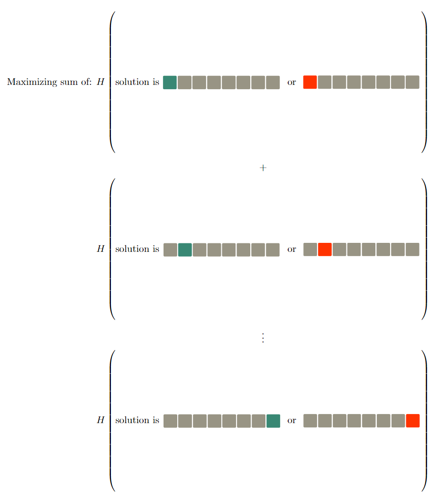
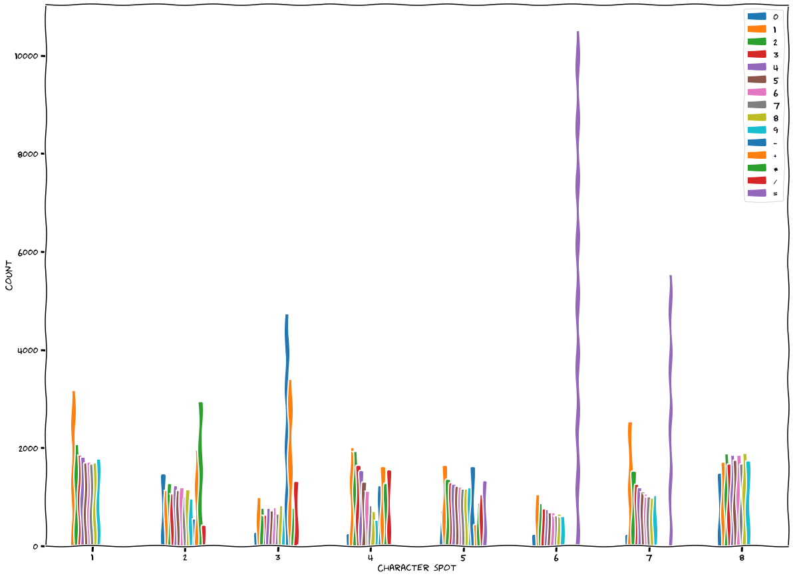

# Introduction

The [Wordle](https://www.nytimes.com/2022/01/31/business/media/new-york-times-wordle.html) [Craze](https://www.statista.com/chart/26765/wordle-monthly-visits-traffic/) has inspired a ton of other spinoff `-le` games. 

One of the Wordle spinoffs me and my friends have recently gotten into is [Nerdle](https://nerdlegame.com/), very similar to Wordle except you attempt to guess an equation which consists of $$ \{ 0-9, +, \times, /, -, = \} $$.

Let's try to write an algorithm for solving this game!

# First attempt

For the first attempt I attempted to calculate the optimal solution by picking the solution which maximized the following equation: 

Where a green tile indicates that the guess's tile is correct (i.e. the solution also has that character there), a red tile indicates the guess tile is wrong (but that character may or may not be somewhere else) and grey means the character was ignored for that calculation.

We can express this slightly more technically as the following:

$$ 
H(x) = \sum_{i=0}^7{(
  -log_2{(\frac{|E_i(x_i)|}{n})} * \frac{|E_i(x_i)|}{n} + 
  -log_2{(\frac{|{NE}_i(x_i)|}{n})} * \frac{|{NE}_i(x_i)|}{n}
  )} 
$$

Where: 

$$
\begin{align}
N &= \text{Our possible solution set} \\
x &\in N \\
n &= |N| \\
E_x(c) &= \{s \in N | s_x = c_x  \} \\
NE_x(c) &= \{s \in N | s_x \neq c_x \}  \\
H(x) &= \text{entropy or information of x} \
\end{align}
$$

According to that algorithm, the optimal starting guess would have been $$ 30-11=19 $$ which anyone familiar with Wordle can tell is a bad guess due to its character reuse.

So whats going on? Well the above algorithm is really just trying to maximize the information obtained by knowing if a character is in a specific spot or not. This is essentially the same as picking a guess which contains the most common character per slot.

We can verify this by plotting the most popular characters for each possible solution. [This code](https://colab.research.google.com/drive/1KUDrvAaLzt8VMxDh-LK4syBvtswU1auZ?usp=sharing) provides us the following distribution:

We can see quite clearly that each of the "optimal" guess's slots are filled with one of the top three characters.

While this algorithm does usually succeed in solving a Nerdle, it tends to take upwards of 4 or 5 guesses, which seems quite excessive. Let's see if we can do any better.

# Second attempt

While showing my first attempt at solving Nerdle to a friend, he mentioned that [3Blue1Brown](https://www.youtube.com/c/3blue1brown) had made a video describing the [optimal strategy for Wordle](https://www.youtube.com/watch?v=v68zYyaEmEA&ab_channel=3Blue1Brown). 3B1B was also using entropy and information theory, the key difference was what he was calculating the entropy of.

After you provide the game an answer, the game automatically marks which characters are in the right place. In the case of Nerdle it uses Green (indicating the character was correct), Purple (indicating the solution has that character, but not in that spot) and Black (indicating that character is not used within the solution). 

Since the answer consists of 8 characters, there are $$ 3^8 $$ possible patterns that the computer can mark. Instead of calculating the entropy around whether or not a solution has a specific character in a specific spot, we'll calculate the entropy over the distribution of solutions within these possible patterns. 

This approach will favor a guess which has a flat distribution for the $$ 3^8 $$ possible patterns. Why is this optimal? Imagine two different cases

- guess $$ A $$ highly favors $$ 2 $$ of the possible distributions, 

- guess $$ B $$ which equally favors all $$ 3^8 $$ distributions.

While guess $$ A $$ does seem decent (after all both distributions indicate we are halfway there) since we are only splitting the solution set in half it's actually quite ineffective. Imagine the solution set started with $$ 1,000,000 $$ possible solutions. Guess $$ A $$ would leave us with $$ 1,000,000 * \frac{1}{2} = 500,000 $$ solutions. Not the greatest reduction.

Guess $$ B $$ will cut the possible solution set by a factor of $$ \frac{1}{3^8} \approxeq 0.000152415790276 $$. Meaning the initial solution set will be cut down to $$ 1,000,000 * \frac{1}{3^8} \approxeq 153 $$ possible solutions. A huge reduction in comparison to guess $$ A $$.

Since guess $$ B $$ has equal splits across all possible patterns then regardless of which pattern ends up being revealed by the game we know that we've maximized the number of solutions we can discard and are no longer prevalent.

This algorithm computed that $$ 48-32=16 $$ was the optimal guess. Which seems quite reasonable as there is no reuse of characters.

Pitting this algorithm against Nerdle typically yields in a solution in $$ 2-3 $$ guesses which I think is quite good. In the 3B1B video, there are discussions on how to further improve the algorithm (calculating the entropy on the next guess) which could be interesting to implement and see how they modify the optimal guess.

# Code 

The code is available [here](https://github.com/kwojcicki/nerdle-solver). 