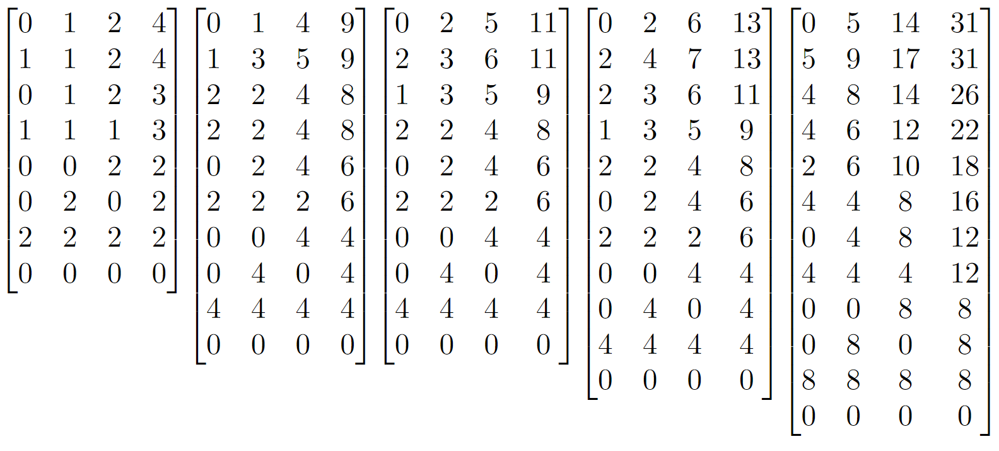
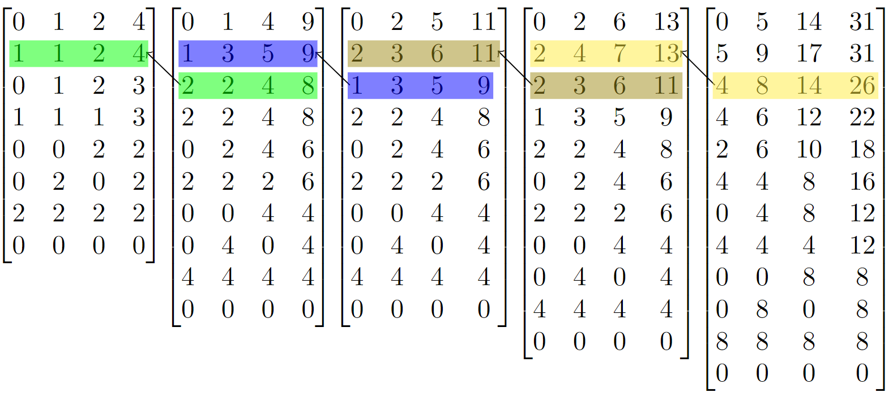
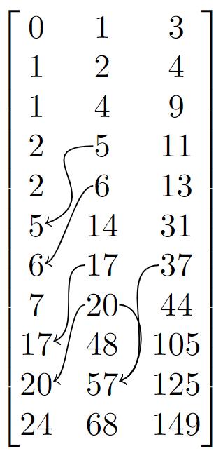
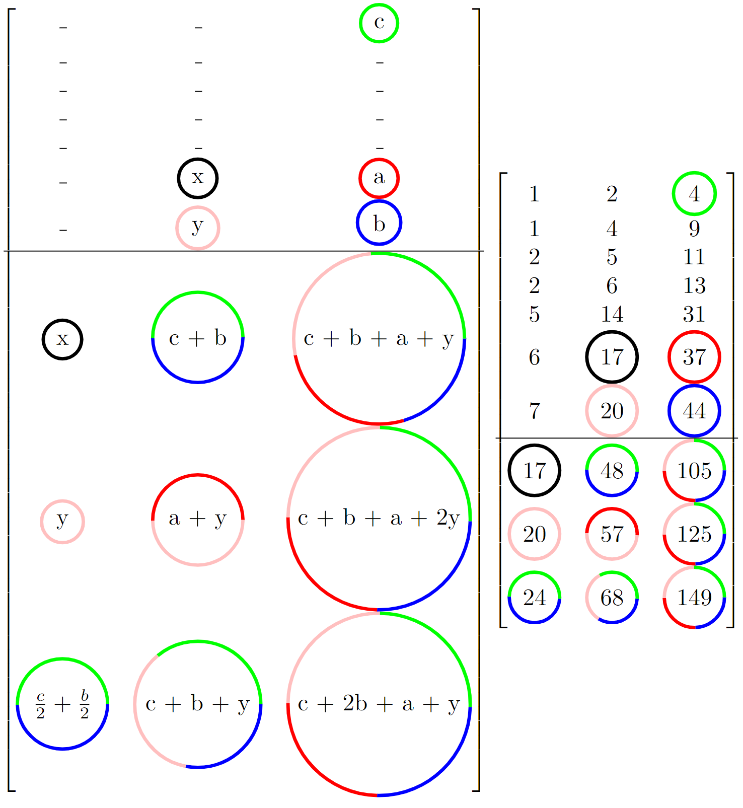

<script type="text/javascript" async src='https://cdnjs.cloudflare.com/ajax/libs/mathjax/2.7.2/MathJax.js?config=TeX-MML-AM_CHTML'></script>

<script type="text/x-mathjax-config">
  MathJax.Hub.Config({ TeX: { extensions: ["color.js"] }});
</script>

<style>
figcaption {
    text-align: center;
}

details {border: 1px solid #E1E1E1; border-radius: 5px; box-shadow: 0 1px 4px rgba(0, 0, 0, .4); color: #363636; margin: 0 0 .4em; padding: 1%;}

details[open] {background: #E1E1E1;}

summary {background: -webkit-linear-gradient(top, #FAFAFA 50%, #E1E1E1 50%); border-radius: 5px; cursor: pointer; font-size: .8em; font-weight: bold; margin: -1%; padding: 8px 0; position: relative; width: 102%;}

summary:hover, details[open] summary {background: #E1E1E1;}

summary::-webkit-details-marker {display: none}

summary:before{border-radius: 5px; content: "+"; color: #363636; display: block; float: left; font-size: 1.5em; font-weight: bold; margin: -2px 10px 0 10px; padding: 0; text-align: center; width: 20px;}

details[open] summary:before {content: "-"; margin-top: -4px;}

</style>

# Introduction

In Jane Street's [latest puzzle, Lesses More,](https://www.janestreet.com/puzzles/lesses-more-index/) we are given the following formula 

$$
\begin{aligned}
f(a,b,c,d) &= f(|a - b|, | b - c|, |c - d|, |d - a|) + 1 \\ 
f(0, 0, 0, 0) &= 1
\end{aligned}
$$

and the following prompt

> Consider the set S = {(a, b, c, d) \| a, b, c, and d are all integers with 0 <= a, b, c, d <= 10,000,000}. Let M be the maximum value f obtains on S. Find (a, b, c, d) in S with minimum sum (a+b+c+d) where f(a, b, c, d) = M.

Which we can express as 

$$
\begin{equation}
\begin{aligned}
\max_{a,b,c,d} \quad & f(a,b,c,d) \\
\textrm{s.t.} \quad &  a + b + c + d \leq w + x + y + z \quad\quad \forall w,x,y,z \in \{ f(a,b,c,d) = f(w,x,y,z) \} \\
 &  0 \leq a,b,c,d \leq 10,000,000 \\
\end{aligned}
\end{equation}
$$

# Initial 

While working on this puzzle with my father and friend the first task was to print out a few of the initial solutions and see if we can spot any obvious pattern.

$$
\begin{aligned}
&[0, 0, 0, 1] \quad 0 \leq a,b,c,d \leq 1 \\
&[0, 0, 1, 3] \quad 0 \leq a,b,c,d \leq 3 \\
&[0, 1, 2, 4] \quad 0 \leq a,b,c,d \leq 4 \\
&[0, 1, 4, 9] \quad 0 \leq a,b,c,d \leq 9 \\\
&[0, 2, 5, 11] \quad 0 \leq a,b,c,d \leq 11 \\
&[0, 2, 6, 13] \quad 0 \leq a,b,c,d \leq 13 \\
&[0, 5, 14, 31] \quad 0 \leq a,b,c,d \leq 31 \\
&[0, 6, 17, 37] \quad 0 \leq a,b,c,d \leq 37 \\
&[0, 7, 20, 44] \quad 0 \leq a,b,c,d \leq 44 \\
&[0, 17, 48, 105] \quad 0 \leq a,b,c,d \leq 105 \\
&[0, 20, 57, 125] \quad 0 \leq a,b,c,d \leq 125 \\
&[0, 24, 68, 149] \quad 0 \leq a,b,c,d \leq 149
\end{aligned}
$$

A few patterns jump out instantly, the first number is always a $$ 0 $$ and the last number is always the upper limit. Besides that, at first glance, there seems to be no other discernible patterns.

# Expansion

Let's expand a few solutions through all their active squares (we'll call them expansions).



What you may notice is that the expansions seem to be build on one another. The third expansion will match the second expansion of the previous solution, however every third solution will double its matching expansion.



This immensely reduces the time we spend searching for the next solution. Instead of trying every single combination and keeping track of which had the greatest depth, we can instead perform $$ 3 $$ expansions and check if it matches the previous solution.

Combine that knowledge with the rough heuristic that the third number, $$ c $$ in each solution seems to be roughly between $$ 2 - 3 $$ times bigger than $$ b $$ and you can quickly obtain the answer.


# Pattern Matching

If you're particularly observant or spent an hour staring at the initial solutions you may have noticed there are plenty more patterns than I originally listed out. Take $$ 30 $$ seconds and see if you can find any more patterns (The leading $$ 0 $$'s were removed for aesthetic purposes).

$$
\begin{bmatrix}
0 & 1 & 3\\
1 & 2 & 4 \\
1 & 4 & 9 \\ 
2 & 5 & 11 \\
2 & 6 & 13 \\
5 & 14 & 31 \\
6 & 17 & 37 \\ 
7 & 20 & 44 \\
17 & 48 & 105
\end{bmatrix}
$$

Hopefully you noticed a few more obvious patterns. If not here are some of the easier ones:

{: style="margin-left:auto;margin-right:auto"} 

If you continue crossing your eyes and finding all the patterns you will notice that, given the past $$ 8 $$ patterns, you can calculate the entirety of the next $$ 3 $$ patterns.

<figure class="image">
  
  <figcaption>Formula used to obtain the next 3 patterns <sup id="a1"><a href="#f1">[1]</a></sup></figcaption>
</figure>

These observations lead to the following code which produce a final answer of $$ [0, 1389537, 3945294, 8646064] $$.

```java
public static void pattern() {
	int[][] last = new int[][] {
			new int[] { 0, 1, 3 }, // 0
			new int[] { 1, 2, 4 }, // 1
			new int[] { 1, 4, 9 }, // 2
			new int[] { 2, 5, 11 }, // 3
			new int[] { 2, 6, 13 }, // 4
			new int[] { 5, 14, 31 }, // 5
			new int[] { 6, 17, 37 }, // 6
			new int[] { 7, 20, 44 }, // 7
	};
	
	while(last[7][2] < 10_000_000) {
		int x = last[6][1];
		int y = last[7][1];
		int z = last[7][2] + last[1][2];
		int i = last[6][2] + y;
		int b = last[7][2];
		last[0] = last[3];
		last[1] = last[4];
		last[2] = last[5];
		last[3] = last[6];
		last[4] = last[7];
		last[5] = new int[] { x, z, z + i };
		last[6] = new int[] { y, i, i + z + y};
		last[7] = new int[] { z / 2, z + y, b + z + i};
		System.out.println("-- ");
		System.out.println(Arrays.toString(last[5]));
		System.out.println(Arrays.toString(last[6]));
		System.out.println(Arrays.toString(last[7]));
	}
}
```

# Notes

<b id="f1">[1]</b> The following is a color augmented version of the matrix formula to, hopefully, assist in quickly understanding the patterns  [↩](#a1)