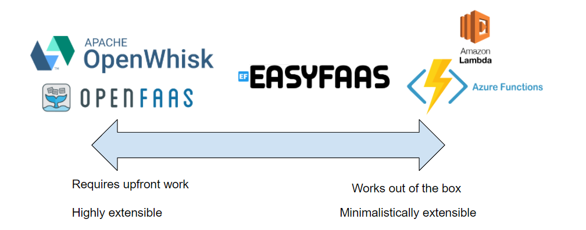

For the past few months I've been working on a side project called [EasyFaaS](https://easyfaas.westus2.cloudapp.azure.com/) (there's a demo instance accessible [here](https://easyfaas.westus2.cloudapp.azure.com/demo), contact me at krystianwojcicki97 at gmail.com for an account). While the product is far from finished i've decided to publish a `v0.1.0` public beta in order to collect feedback and to show off whats already been done.

So what is [EasyFaaS](https://easyfaas.westus2.cloudapp.azure.com/)? As the name suggests it's a product designed to allow customers to deploy their own FaaS platform (either to a local bare metal k8s cluster or to a cloud provider) and have the ability to instantly be developing and publishing functions. The project is more geared towards enterprise solutions (due to its focus on security and authorization) but is also meant to be used by solo developers.

This project was largely inspired by my past work experience, but I believe it has a legitimate purpose in the current market place. 

There exists a spectrum of FaaS solutions. 

- On one side you have solutions such as [OpenWhisk](https://openwhisk.apache.org/) or [OpenFaaS](https://www.openfaas.com/). These solutions while great require a non-trivial amount of upfront work in order to fit them into an enterprise's daily operations. Some of the upfront work consists of integrating your companies authentication mechanisms, adding RBAC controls or hooking up your CICD pipelines.
- On the other side you have solutions such as [Azure Functions](https://azure.microsoft.com/en-us/services/functions/#overview) or [AWS Lambda](https://aws.amazon.com/lambda/) which allow for minimal tinkering but work instantly out of the box and cover most use cases. Unfortunately as your usage expands from, for example, just using Azure Functions to using all of Azure; then heavy domain knowledge will be required, which not all employees of an enterprise will be capable of understanding. Even as a software engineer I frequently find AWS and Azure clunky and difficult to use, for less technical employees there often is extreme resistance in using these platforms. 

EasyFaaS strives to be both extensible while also working out of the box even allowing for less technically savvy users to utilize every single feature.

Ultimately the goal for EasyFaaS is to allow it's users to deploy a function (or a docker container) directly through its UI and give them the tools they need to monitor, diagnose, secure, distribute and redeploy their code all with a few clicks of their mouse in our UI (you can even write unit tests within the UI!).

Many necessary features are not yet in place (such as additional triggers, support for more programming languages, the list goes on and on) but work is constantly being done on bringing EasyFaaS to a GA state. Head on over to the [demo instance](https://easyfaas.westus2.cloudapp.azure.com/demo) and try running a few of the publicly accessible functions and let me know what you think! The [EasyFaaS](https://easyfaas.westus2.cloudapp.azure.com/) landing page is actually a function hosted with the demo instance, isn't that cool!